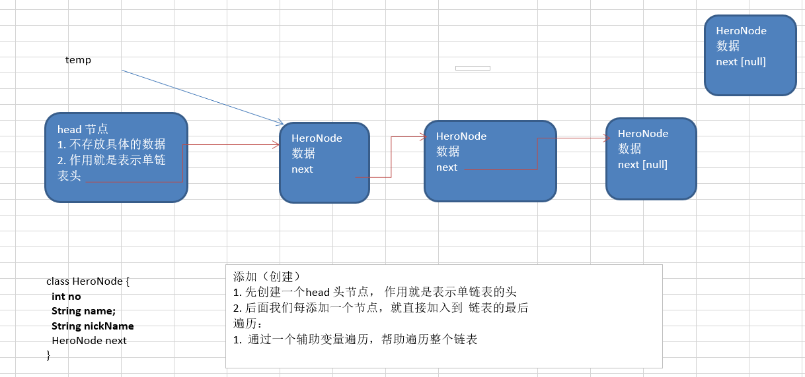
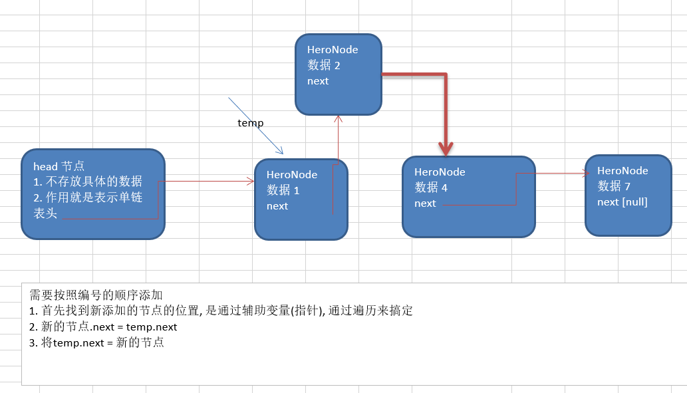
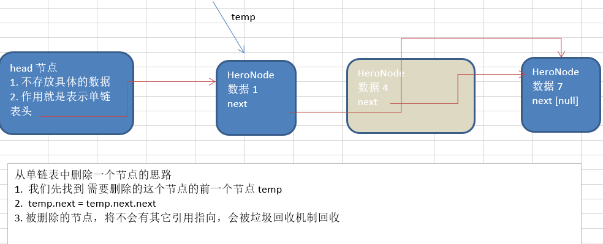
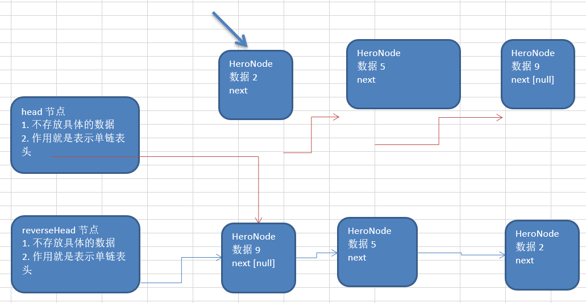
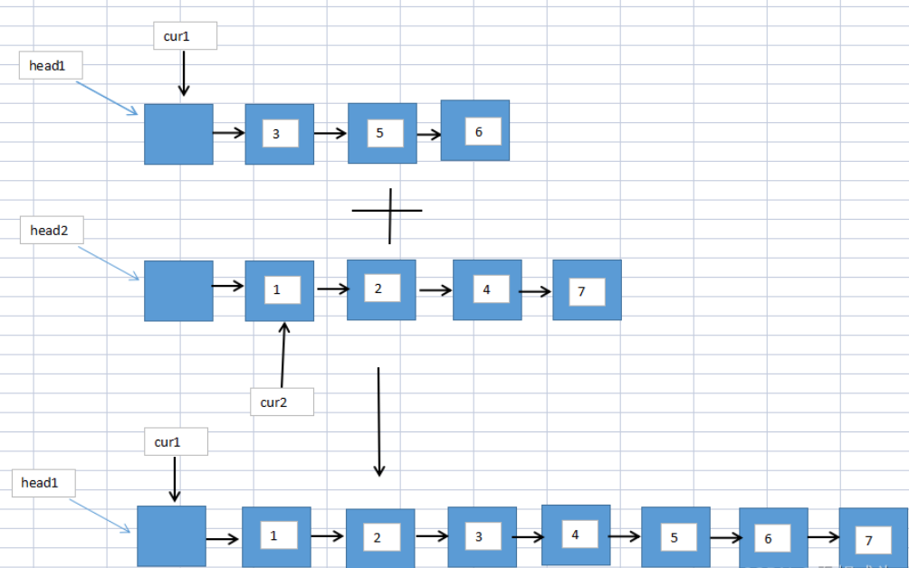

# Java data structure algorithms

> **注意**：代码只是某一解法，不是唯一解法。思路才是最重要的

## 介绍
Java data structure algorithms  
尚硅谷java数据结构和算法相关

## data structure
### 1.稀疏数组
#### 1) 二维数组 -> 稀疏数组

1. 遍历  原始的二维数组，得到有效数据的个数 sum
2. 根据sum 就可以创建 稀疏数组 sparseArr   int[sum + 1] [3]
3. 将二维数组的有效数据数据存入到 稀疏数组
#### 2) 稀疏数组  -> 二维数组
1. 先读取稀疏数组的第一行，根据第一行的数据，创建原始的二维数组
2. 在读取稀疏数组后几行的数据，并赋给 原始的二维数组 即可.
#### 3) 数组  ->  环形队列

1.  front 变量的含义做一个调整： front 就指向队列的第一个元素, 也就是说 arr[front] 就是队列的第一个元素
    front 的初始值 = 0
2.  rear 变量的含义做一个调整：rear 指向队列的最后一个元素的后一个位置. 因为希望空出一个空间做为约定.
    rear 的初始值 = 0
3. 当队列满时，条件是  (rear  + 1) % maxSize == front 【满】
4. 对队列为空的条件， rear == front 空
5. 当我们这样分析， 队列中有效的数据的个数   (rear + maxSize - front) % maxSize   // rear = 1 front = 0

### 2.LinkedList
#### 单链表
##### 创建

添加（创建）
1. 先创建一个head 头节点， 作用就是表示单链表的头
2. 后面我们每添加一个节点，就直接加入到  链表的最后
   遍历：
1.  通过一个辅助变量遍历，帮助遍历整个链表
##### 添加

需要按照编号的顺序添加
1. 首先找到新添加的节点的位置, 是通过辅助变量(指针), 通过遍历来搞定
2. 新的节点.next = temp.next
3. 将temp.next = 新的节点
##### 删除

从单链表中删除一个节点的思路
1.  我们先找到 需要删除的这个节点的前一个节点 temp
2.  temp.next = temp.next.next
3. 被删除的节点，将不会有其它引用指向，会被垃圾回收机制回收
#### 面试题
##### 1>求单链表中有效节点的个数
```java
    //方法：获取到单链表的节点的个数(如果是带头结点的链表，需求不统计头节点)
    /**
     * @param head 链表的头节点
     * @return 返回的就是有效节点的个数
     */
    public static int getLength(HeroNode head) {
        if (head.next == null) { //空链表
            return 0;
        }
        int length = 0;
        //定义一个辅助的变量, 这里我们没有统计头节点
        HeroNode cur = head.next;
        while (cur != null) {
            length++;
            cur = cur.next; //遍历
        }
        return length;
    }
```
##### 2>查找单链表中的倒数第k个结点 【新浪】
1. 编写一个方法，接收head节点，同时接收一个index
2. index 表示是倒数第index个节点
3. 先把链表从头到尾遍历，得到链表的总的长度 getLength
4. 得到size 后，我们从链表的第一个开始遍历 (size-index)个，就可以得到
5. 如果找到了，则返回该节点，否则返回nulll
##### 3>单链表的反转【腾讯】
1. 先定义一个节点 reverseHead = new HeroNode();
2. 从头到尾遍历原来的链表，每遍历一个节点，就将其取出，并放在新的链表reverseHead 的最前端.
3. 原来的链表的head.next = reverseHead.next

##### 4>从尾到头打印单链表 【百度】
1.方式1： 先将单链表进行反转操作，然后再遍历即可，这样的做的问题是会破坏原来的单链表的结构，不建议
2.方式2：可以利用栈这个数据结构，将各个节点压入到栈中，然后利用栈的先进后出的特点，就实现了逆序打印的效果.

##### 5>合并两个有序的单链表，合并之后的链表依然有序
1.利用第三个单链表存储两个单链表的节点，若两个链表均为空，则直接返回；若其中一个链表为空，则直接将另一个链表连接至链表3上；
2.若两个链表均不为空，先将其中一个链表1连接至链表3，然后遍历另一个链表2，将链表2中的节点按照顺序连接至链表3上。
3.若出现链表3遍历完毕但链表2尚未遍历完毕的情况，可以直接将链表2剩下的节点连接至链表3尾部。

## algorithms