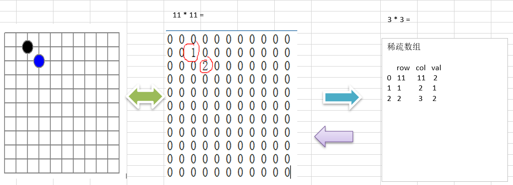
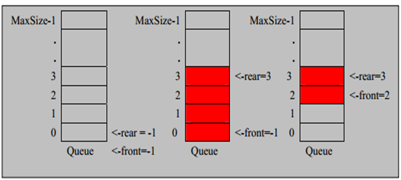

# Java data structure algorithms

> **注意**：代码只是某一解法，不是唯一解法。思路才是最重要的

## 介绍
Java data structure algorithms  
尚硅谷java数据结构和算法相关

## data structure
### 1.稀疏数组
#### 1) 二维数组 -> 稀疏数组

1. 遍历  原始的二维数组，得到有效数据的个数 sum
2. 根据sum 就可以创建 稀疏数组 sparseArr   int[sum + 1] [3]
3. 将二维数组的有效数据数据存入到 稀疏数组
#### 2) 稀疏数组  -> 二维数组
1. 先读取稀疏数组的第一行，根据第一行的数据，创建原始的二维数组
2. 在读取稀疏数组后几行的数据，并赋给 原始的二维数组 即可.
#### 3) 数组  ->  环形队列

1.  front 变量的含义做一个调整： front 就指向队列的第一个元素, 也就是说 arr[front] 就是队列的第一个元素
    front 的初始值 = 0
2.  rear 变量的含义做一个调整：rear 指向队列的最后一个元素的后一个位置. 因为希望空出一个空间做为约定.
    rear 的初始值 = 0
3. 当队列满时，条件是  (rear  + 1) % maxSize == front 【满】
4. 对队列为空的条件， rear == front 空
5. 当我们这样分析， 队列中有效的数据的个数   (rear + maxSize - front) % maxSize   // rear = 1 front = 0
## algorithms